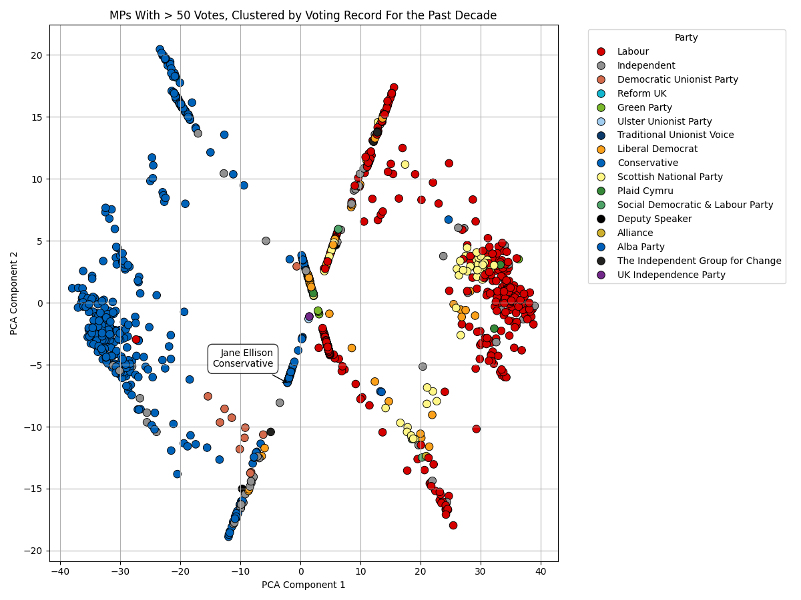

Some scripts to load, parse, and perform initial visualisations of MP voting history as supplied by the Parliment API that aims to reflect the Hansard record.

A worrying amount of data is missing from this API, that seems to be nearly ten years old.

## Vote Record API:

https://commonsvotes-api.parliament.uk/swagger/ui/index#/Divisions

### Clustered voting pattern of MPs with more than 50 votes over the past decade

### 3D clustered voting pattern of MPs with more than 50 votes over the past decade

[3D clustered voting pattern of MPs with more than 50 votes over the past decade](./visualisations/mp_votes_3d_cluster.html)