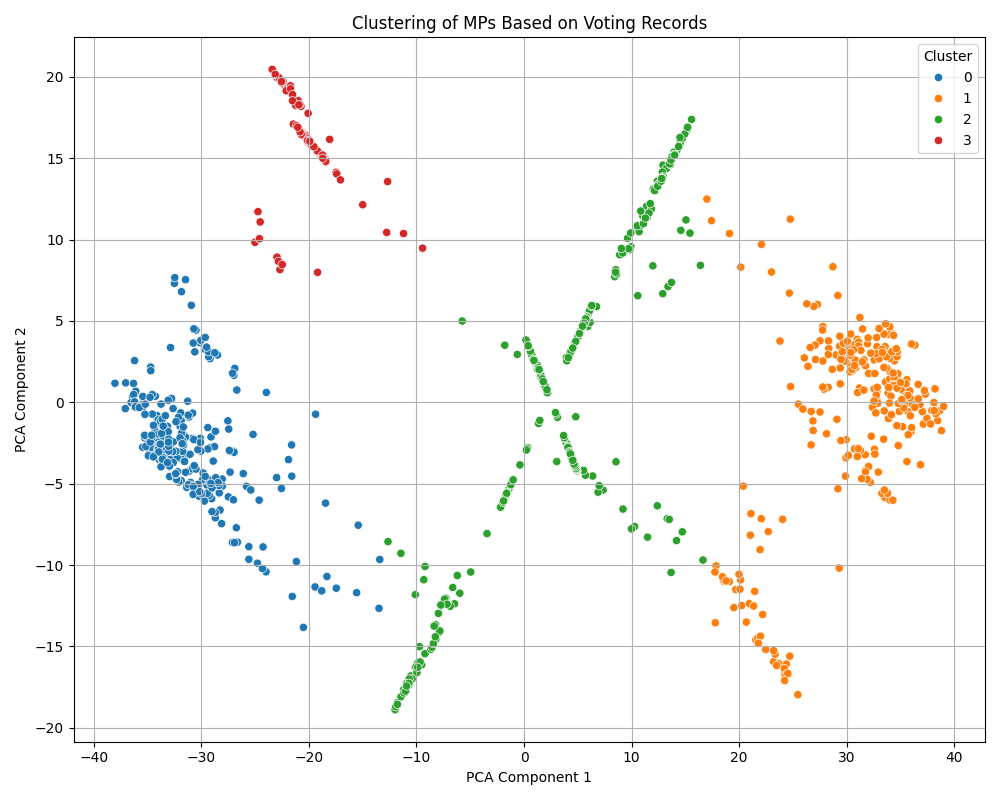

Some scripts to load, parse, and perform initial visualisations of MP voting history as supplied by the Parliment API that aims to reflect the Hansard record.

A worrying amount of data is missing from this API, that seems to be nearly ten years old.

https://commonsvotes-api.parliament.uk/swagger/ui/index#/Divisions

